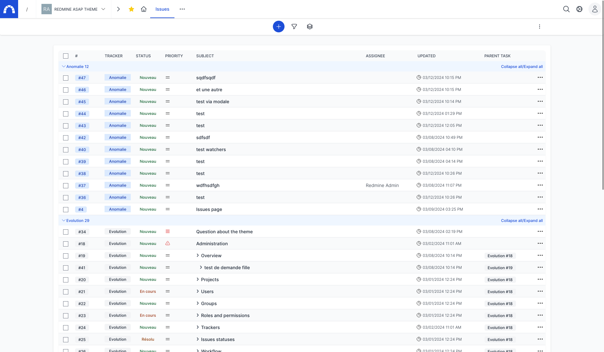

# Redmine asap theme

This plugin try to propose a new UX/UI for Redmine and try new tools like stimulus/turbo and Tailwindcss (one day Hotwire :smiley:).

* Status : in development and for fun not a real plugin for now.
* Compatibility : Redmine 5.1.1

If you want to test it quickly with docker, you can use the repo https://github.com/tantic/redmine_asap_docker.git

Here are some screenshots





## Documentation

* [Presentation](doc/presentation.md)
* [Features](doc/features.md)
* [Screenshots](doc/screenshots.md)
* [Progress & demo](doc/progress.md)
* [Development](doc/development.md)

## Installation

This plugin has been tested with Redmine 5.1.x

```
cd $REDMINE_ROOT
git clone https://github.com/tantic/redmine_asap_theme.git plugins/redmine_asap_theme
bundle install
bundle exec rake redmine:plugins:migrate RAILS_ENV=production
```

## Contributing

I'm not a designer neither a real developer so be comprehensive :smiley: I would be really happy to have help on this, you're all really welcome.

* Fork it
* Create your feature branch (git checkout -b my-new-feature)
* Commit your changes (git commit -am 'Add some feature')
* Push to the branch (git push origin my-new-feature)
* Create new Pull Request