# Redmine ASAP Theme

This plugin try to propose a new UX/UI for Redmine with new tools like Stimulus/Turbo and Tailwindcss (one day Hotwire :-)).

* Status : first version usable but need to be used and improved (feedback appreciated)
* Compatibility :
  * 2.1.6 work for Redmine 6.0.x
  * `>=` 2.2.0 work for Redmine 6.1.x only
  * 2.4.0 should work for Redmine 7.0 (need to be more tested)


If you want to test it quickly with docker, you can use the repo https://github.com/tantic/redmine_asap_docker.git


This plugin is part of a suite which add features to redmine :
* [Redmine asap theme](https://github.com/tantic/redmine_asap_theme) : new UX/UI, new navigation
* [Redmine asap user features](https://github.com/tantic/redmine_asap_user_features) : new personal features like inbox, todo
* Redmine asap pilot : dashboards to pilote multi-projects

## Documentation

https://tantic.github.io/redmine_asap_docs/docs/theme/intro

## Features

UX/UI
* New general design based on Tailwind CSS and stimulus / turbo
* New navbar for navigation and new menu for project
* New user menu on the navbar
* Toggle display of the query form and store it in the session
* New home page with bookmarked projects, project. Project overview
* Login page is customizable with picture (some wallpapers are available)
* Logo's color is customizable
* Dark theme : each user can choose light or dark theme from the user preferences
* Responsive mode for mobile and tablet devices
* keyboard shortcuts : Shift+? to access modal help, CTRL+k for quick navigation

User
* Account is now preferences and is displayed in a modal
* Local avatar or letter for users (all credits to A.Chaika and contributors of the next versions)
* New options in the preferences to customize the user experience : dark/light theme, font size, bold issues assigned to me or not, issue panel for quick access to issues, kanban view
* Notifications center : display notifications in the main navbar (top right corner)
* Ability to enable/disable keyboard shortcuts from the shortcuts modal (stored in user preferences) SHIFT+? to access modal help

Project
* Logo or Letter avatar for projects
* Project homepage : member box and subprojects box overrides (search and tree...)

Issues
* Issue statuses can be customized (background color and color)
* Notes form is displayed on the bottom of the issue page (no need to edit the issue to add a note)
* Tracker can be customized (background color and color)
* Colors and icons on default priorities (not customisable for now)
* Display issue in a panel when click on an issue of the main list : you can now edit online all attributes
* "Create and continue" button on issue show page to create a new note and continue editing with fields pre-filled
* [beta] Kanban board for issues with drag and drop support between status and in the same column, customizable columns and swim lanes

## Screenshots

<table>
  <tr>
    <td align="center">
      <a href="doc/screenshots/login.png">
        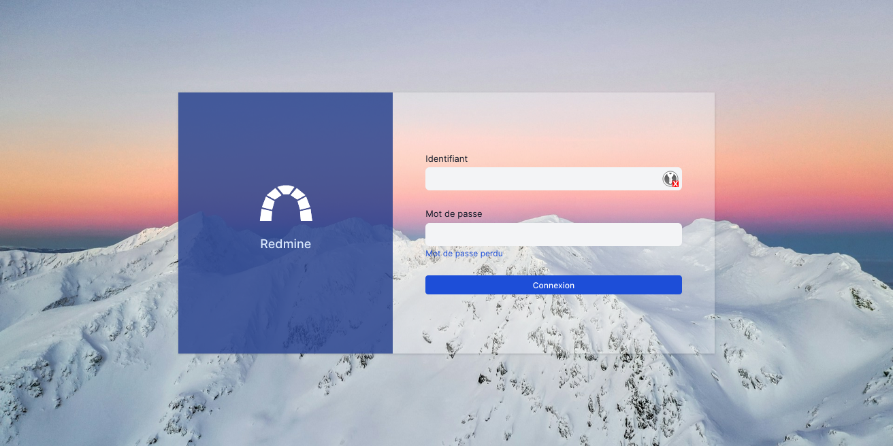<br>
            Login page
      </a>
    </td>
    <td align="center">
      <a href="doc/screenshots/welcome.png">
        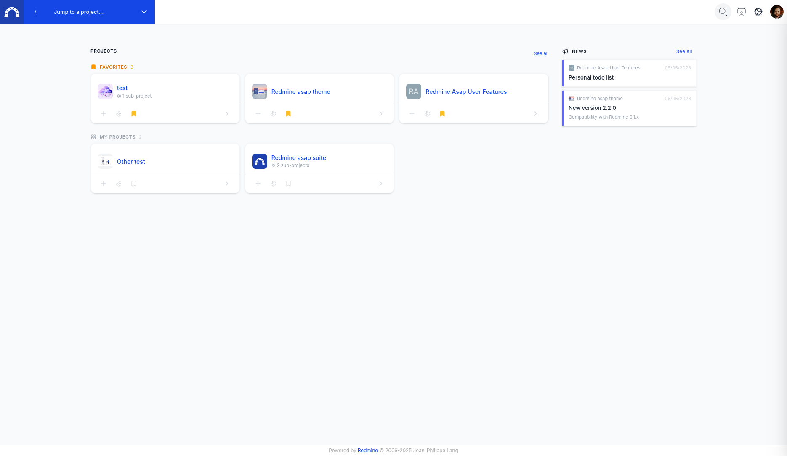<br>
            Welcome page
      </a>
    </td>
    <td align="center">
      <a href="doc/screenshots/issues.png">
        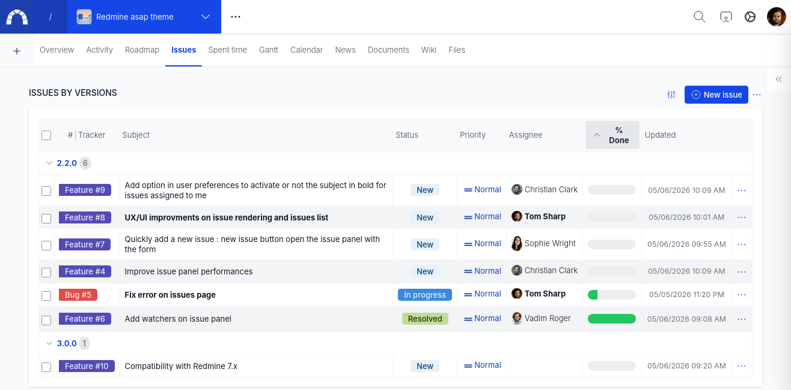<br>
            Issues list
      </a>
    </td>
  </tr>
  <tr>
    <td align="center">
    <a href="doc/screenshots/issues-dark.png">
        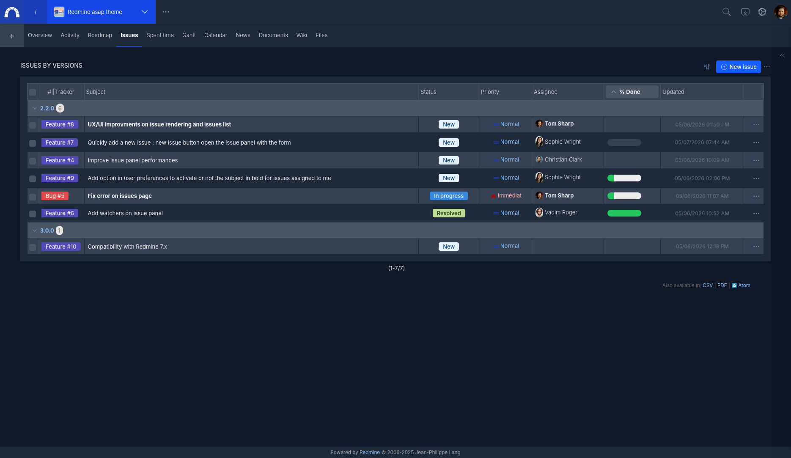<br>
            Issues list dark
    </a>
    </td>
    <td align="center">
      <a href="doc/screenshots/issue-panel.png">
        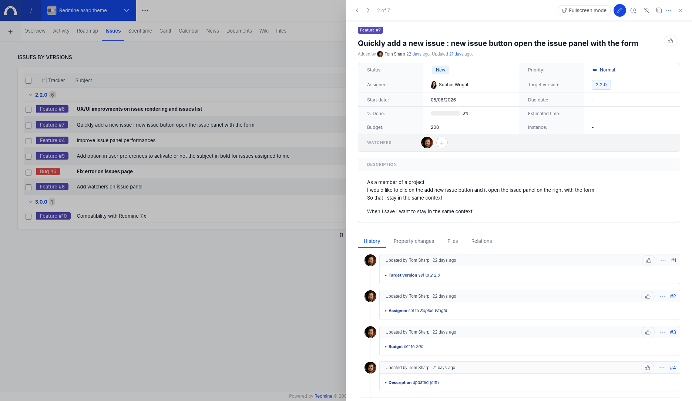<br>
            Issue panel
      </a>
    </td>
    <td align="center">
      <a href="doc/screenshots/issue-panel-dark.png">
        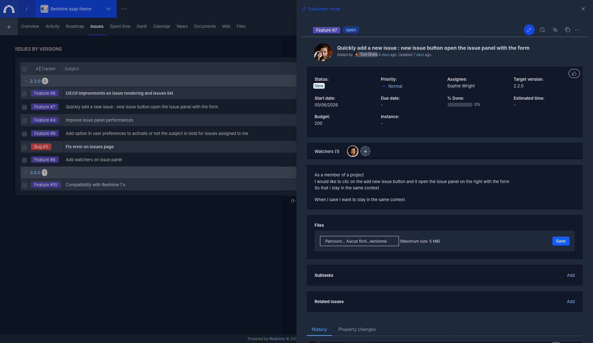<br>
            Issue panel dark    
      </a>
    </td>
  </tr>
  <tr>
    <td align="center">
        <a href="doc/screenshots/issue-panel-edit.png">
            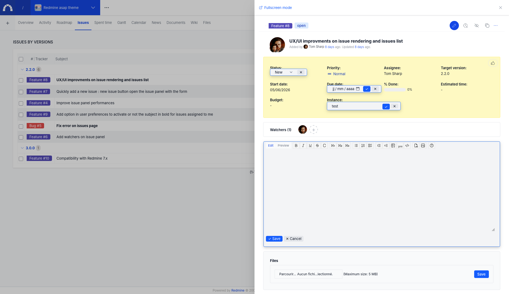<br>
                Edit inline issue
        </a>
    </td>
    <td align="center">
        <a href="doc/screenshots/preferences.png">
            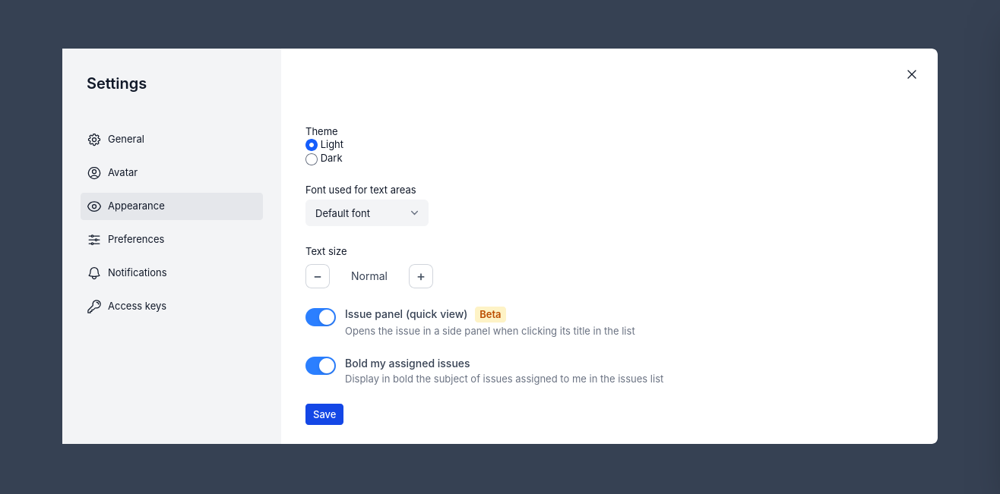<br>
                Preferences
        </a>
    </td>
    <td align="center">
        <a href="doc/screenshots/profile.png">
            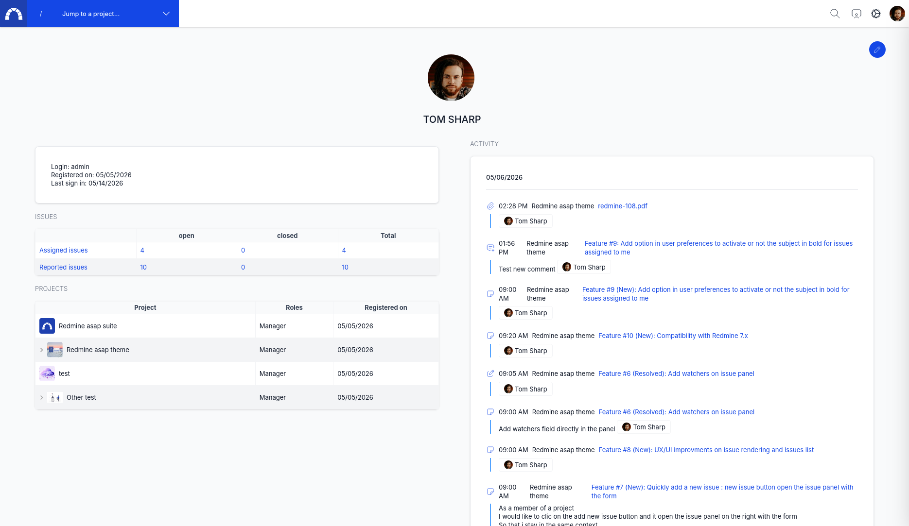<br>
                Profile page
        </a>
    </td>
  </tr>
  <tr>
    <td align="center">
        <a href="doc/screenshots/issues-board-view.png">
            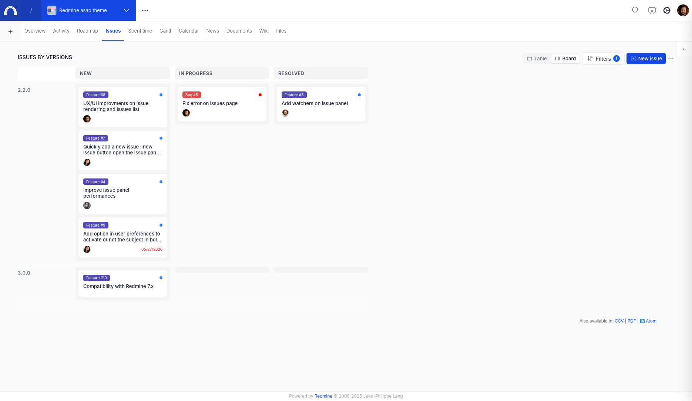<br>
                Kanban board view
        </a>
    </td>
    <td align="center">
    <a href="doc/screenshots/mobile.png">
        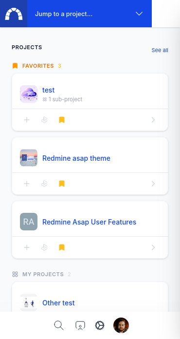<br>
            Mobile view
    </a>
    </td>
    <td align="center">
    <a href="doc/screenshots/mobile2.png">
        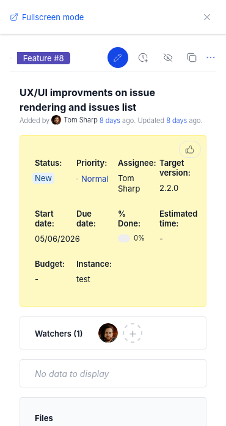<br>
            Mobile view 2
    </a>
    </td>
  </tr>
 <tr>
    <td align="center">
        <a href="doc/screenshots/issues-dark.png">
            <br>
                Kanban board view
        </a>
    </td>
    <td align="center">
    <a href="doc/screenshots/shortcuts.png">
        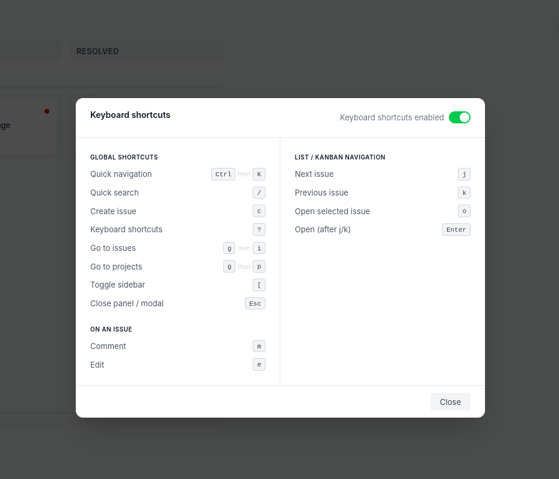<br>
            Mobile view
    </a>
    </td>
    
  </tr>
</table>


## Installation

This plugin has been tested with Redmine 6.0.x and 6.1.x

```
cd $REDMINE_ROOT
git clone https://github.com/tantic/redmine_asap_theme.git plugins/redmine_asap_theme
bundle install
bundle exec rake redmine:plugins:migrate RAILS_ENV=production
```

### Configuration

Go to the admin section > /settings/plugin/redmine_asap_theme to change the settings.
Note : you can add your own wallpapers for the login page in the folder /assets/images/login and restart Redmine.

* Enable "Enable Turbo Frames panel — side panel without full page reload (beta)" if you want to use the turbo frames panel. Don't enable "Enable turbo for a faster experience (beta)" option for now it's not ready yet (js incompatibility).
* Choose a wallpaper for the login page
* Set the color for the redmine top left logo
* field icon if you want to add a weather field (sun, cloud...)

Go to the admin section > tracker > choose a tracker to change the background and text color.
Go to the admin section > Issue status > choose a status to change the background and text color.


## Contributing

I'm not a designer neither a real developer so be comprehensive :smiley: I would be really happy to have help on this, you're all really welcome.

* Fork it
* Create your feature branch (git checkout -b my-new-feature)
* Commit your changes (git commit -am 'Add some feature')
* Push to the branch (git push origin my-new-feature)
* Create new Pull Request
