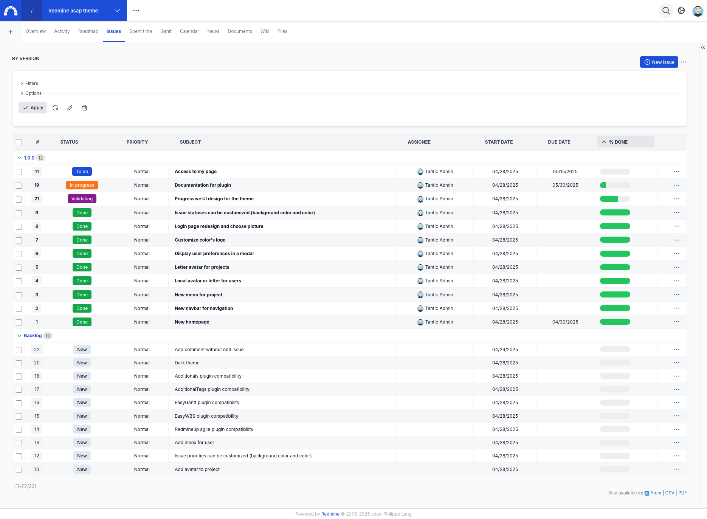

# Redmine ASAP Theme

This plugin try to propose a new UX/UI for Redmine with new tools like Stimulus/Turbo and Tailwindcss (one day Hotwire :-)).
The first version started almost from a blank page by replacing all Redmine pages. It worked but it's not enough progressive.
This version start from the original theme of Redmine so all pages works (normally) and the theme can be used now.

* Status : first version usable but need to be used and improved (feedback appreciated)
* Compatibility : work for Redmine >=6 (other versions not tested)

If you want to test it quickly with docker, you can use the repo https://github.com/tantic/redmine_asap_docker.git

## Documentation

https://tantic.github.io/redmine_asap_docs/docs/theme/intro

## Features

* New general design
* New navbar for navigation and new menu for project
* New home page
* Local avatar or letter for users (all credits to A.Chaika and contributors of the next versions)
* Letter avatar for projects
* Account is now preferences and is displayed in a modal
* Logo's color is customizable
* Login page is customizable with picture
* Issue statuses can be customized (background color and color)

## Screenshots





## Installation

This plugin has been tested with Redmine 6.0.x

```
cd $REDMINE_ROOT
git clone https://github.com/tantic/redmine_asap_theme.git plugins/redmine_asap_theme
bundle install
bundle exec rake redmine:plugins:migrate RAILS_ENV=production
```

## Contributing

I'm not a designer neither a real developer so be comprehensive :smiley: I would be really happy to have help on this, you're all really welcome.

* Fork it
* Create your feature branch (git checkout -b my-new-feature)
* Commit your changes (git commit -am 'Add some feature')
* Push to the branch (git push origin my-new-feature)
* Create new Pull Request