# Screenshots

## Login

The login page with a background image that can be choose in the plugin settings.

## Navigation

## Welcome

For now, the welcome page display only user projects

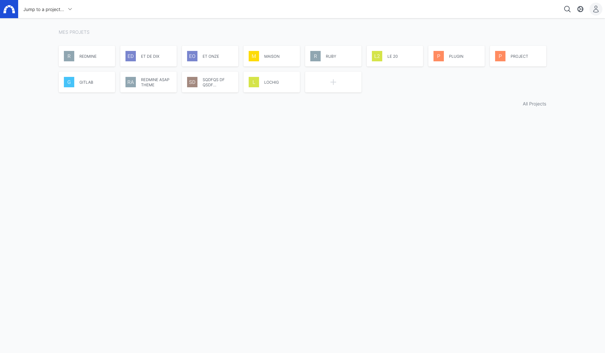

## Projects list

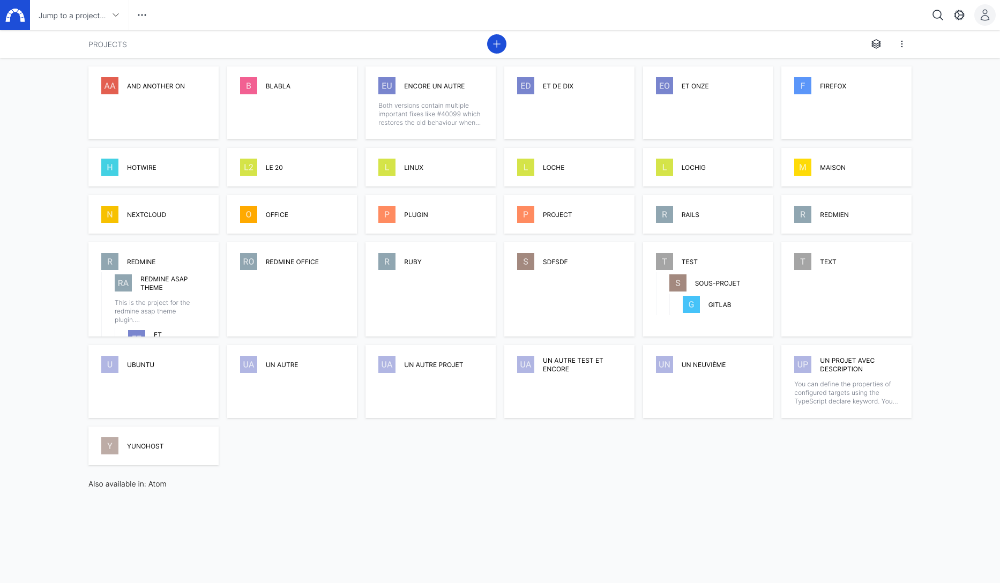

## Project

### Overview

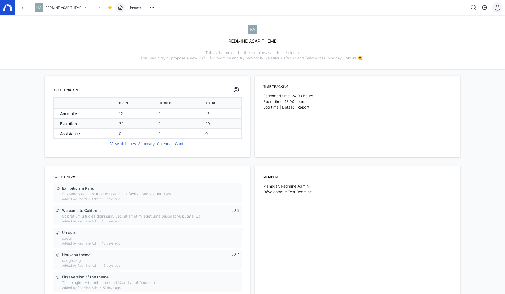

### Issues

## Activities

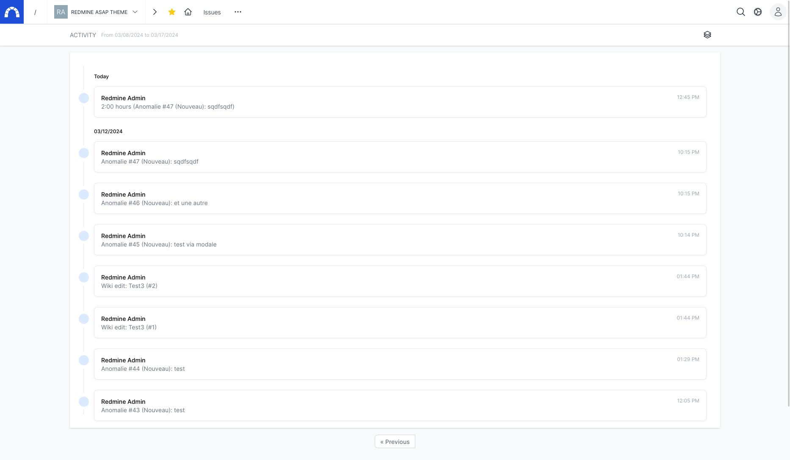

## Roadmap

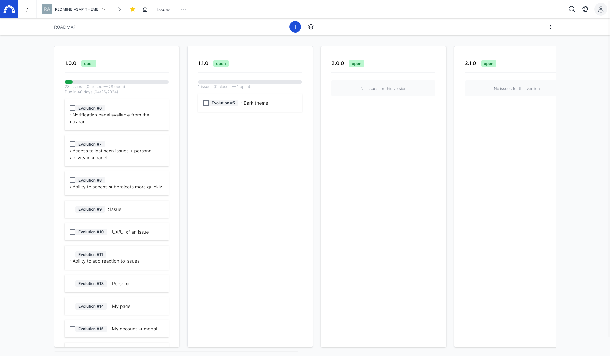

## Time entries

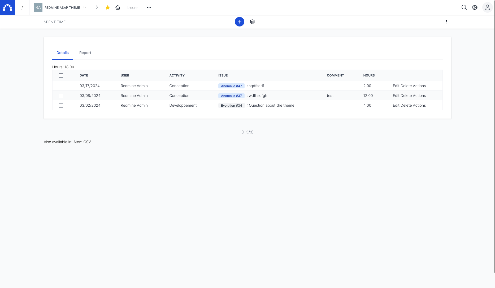

### Gantt (WIP)

Work in progress

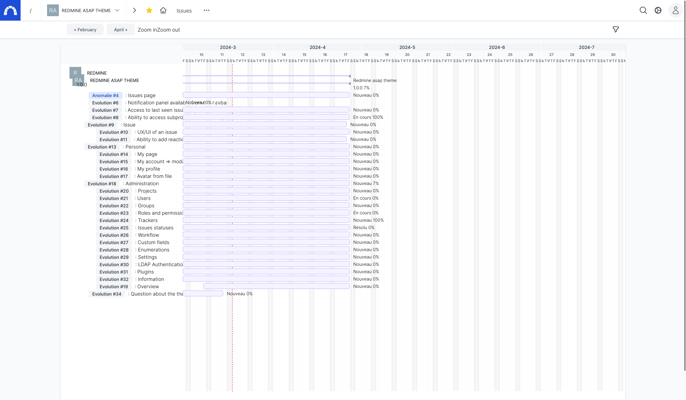

### Calendar

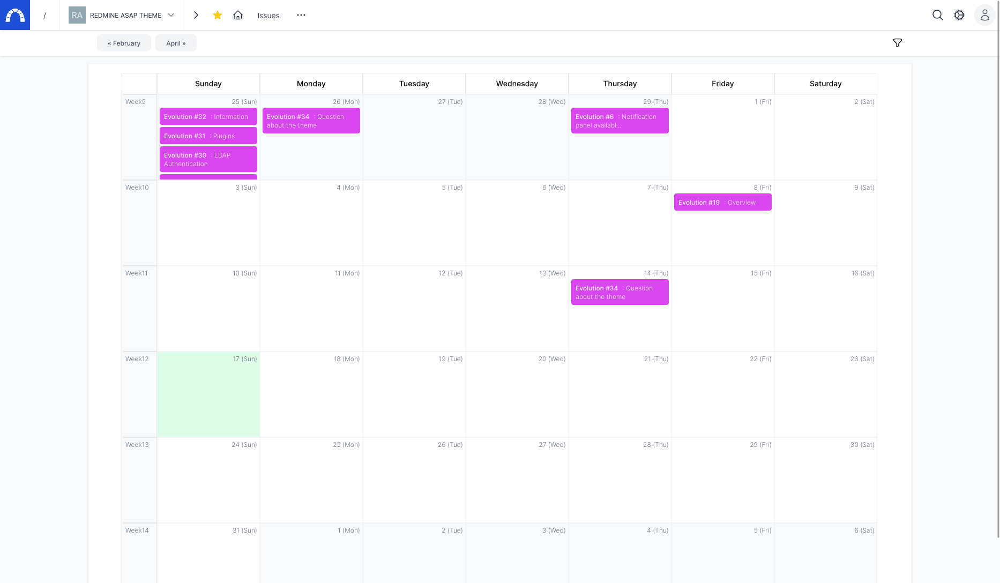

### News

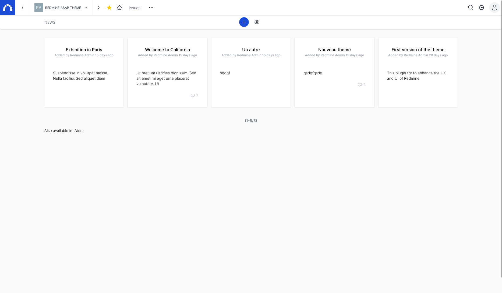

### Documents

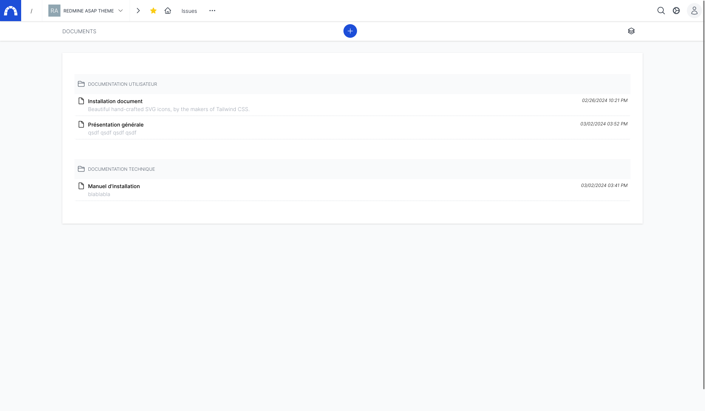

### Wiki

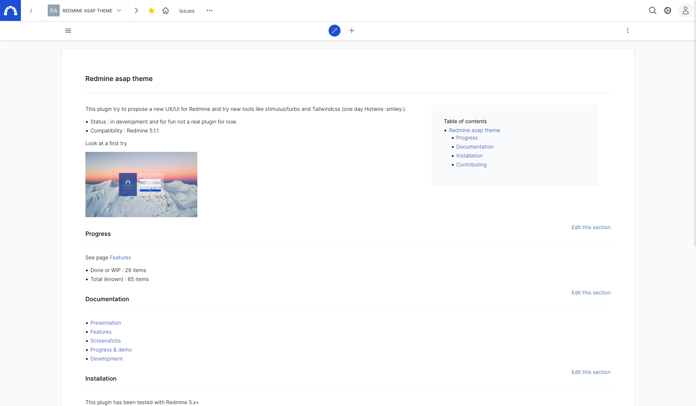

### Forum

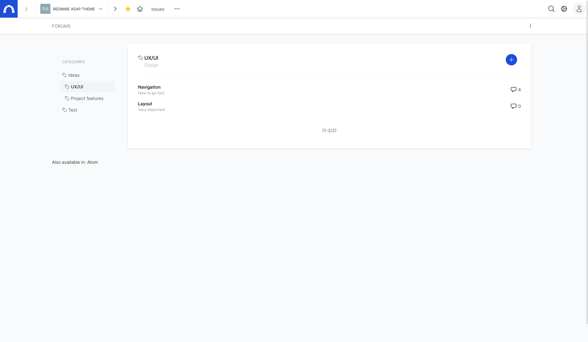

### Files

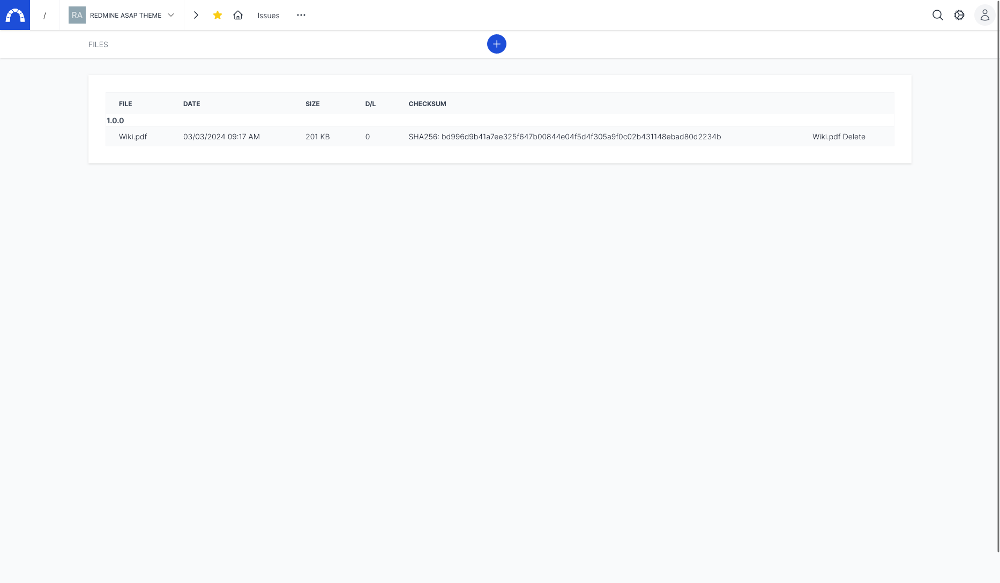

### Repositories

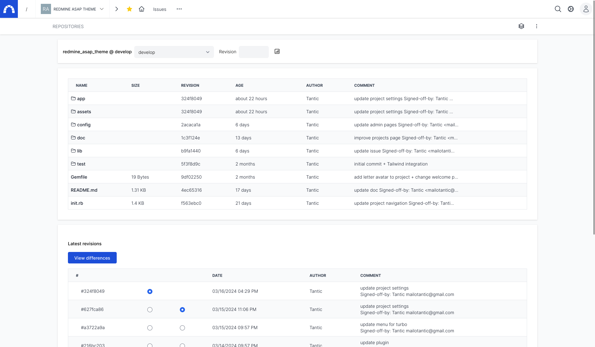

### Project settings

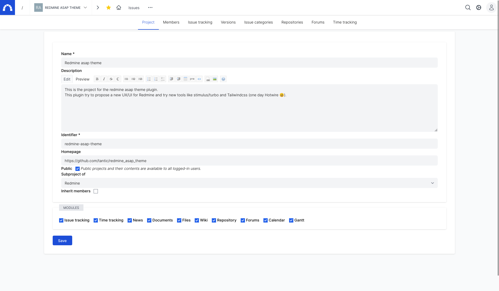

## Issue

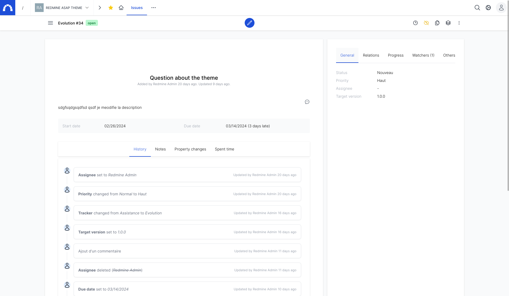

## User settings (ex my account)

## User profile

## Administration

## Redmine asap theme settings

Settings for the plugin

Ability to change the background

Settings for colors (more to be defined)

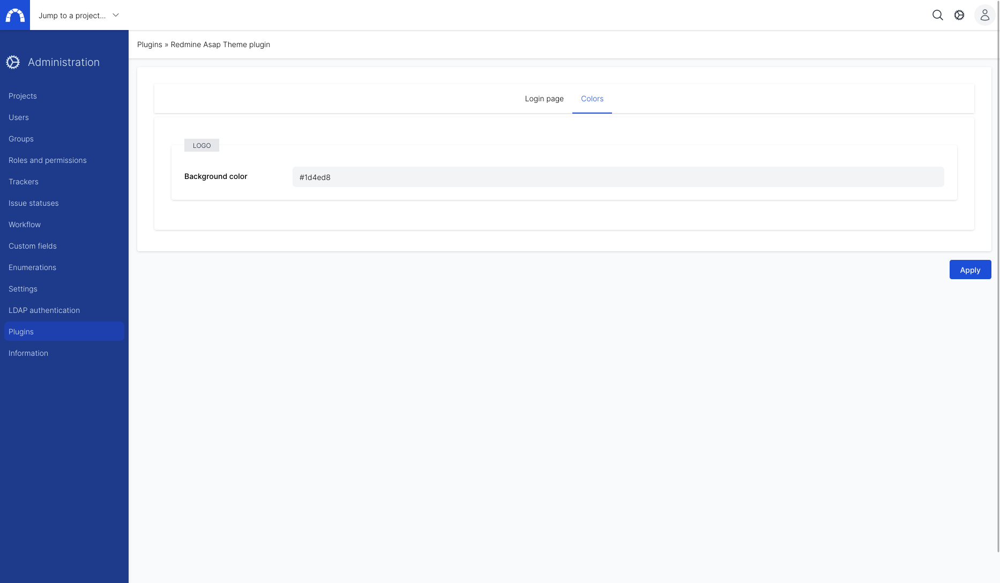

## About

## Flash message

## Mobile

