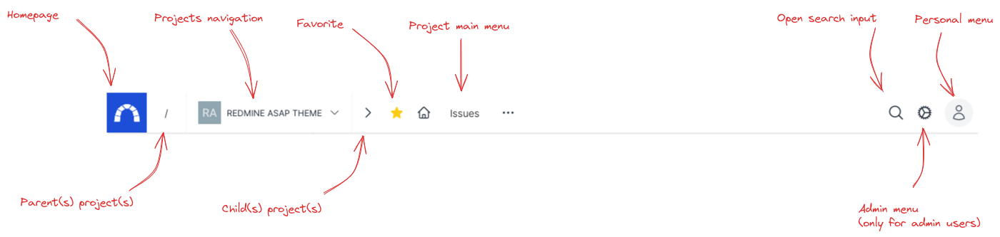
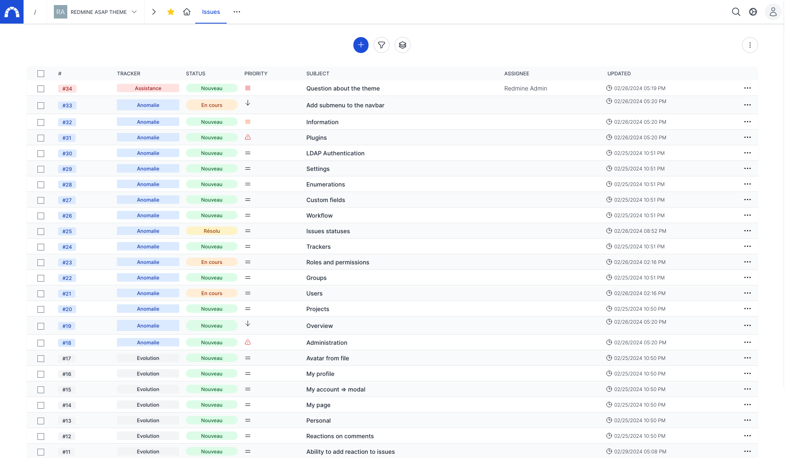
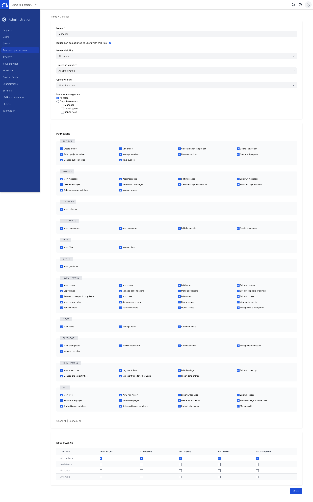

# Screenshots

## Login

## Navigation

## Project views

### List

### Calendar

### Gantt

## Issue

## Wiki

## Activities

## Roadmap

## Time entries

## News

## Documents

## Files

## Forum

## User settings (ex my account)

## User profile

## Administration

## Redmine asap theme settings

Settings for the plugin

Ability to change the background

## About

## Flash message

## Mobile

## Projects

